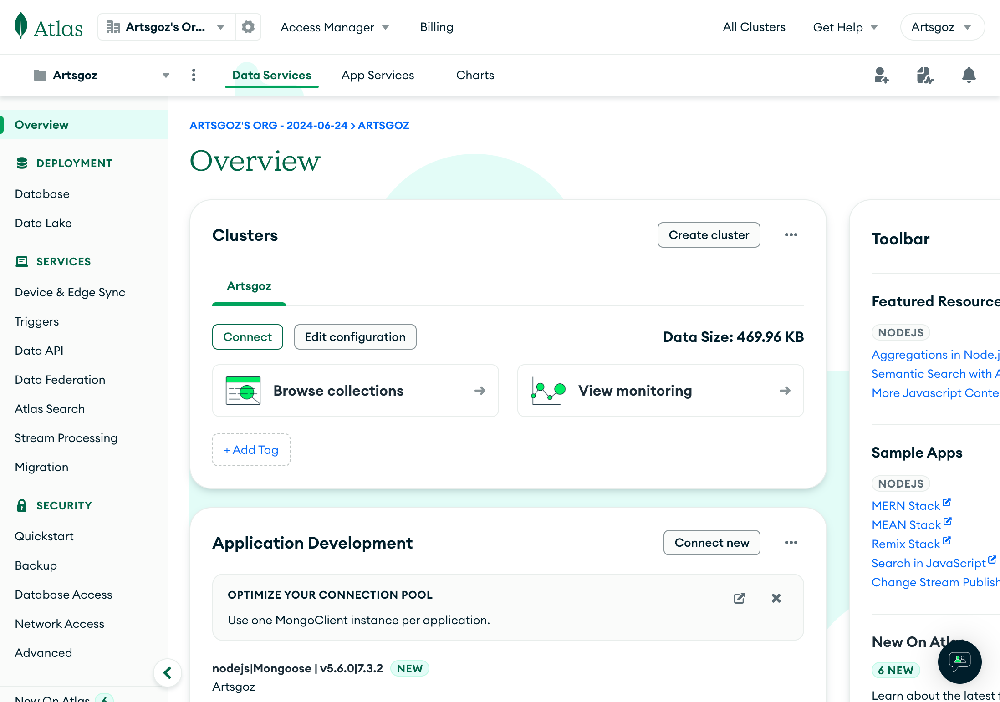

# Database Configuring

## Access to the Database

Please go [https://cloud.mongodb.com/](https://cloud.mongodb.com/) and sign in via GoogleOAuth (make sure you are logging in by Artsgoz IT account) so you can see the organization page and choose the Artsgoz Project. Then, you will see the clusters. That's all

<figure><figcaption>
the overview page of the clusters
</figcaption></figure>

## Objects in the collections

The objects in the collections will appear when it's created.&#x20;

## About the `ajarns` Object

The `ajarns` object in the collections is the object contains the faculty staff lists and strictly prohibited from conducting any actions


DO NOT PERFORM ANY ACTION IN THE `ajarns` OBJECT WITHOUT PERMISSIONS

